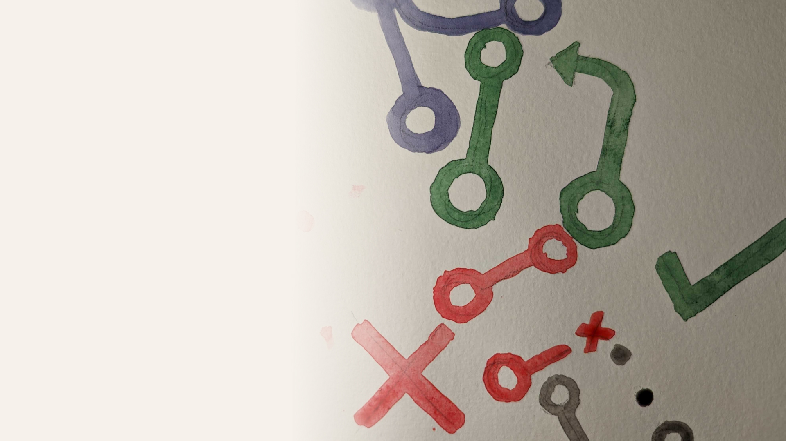

<!-- _class: title -->

# Working Effectively With Pull Requests

### 👦 Steven Hicks

### 🌎 pull-requests.stevenhicks.me

### ✉️ stevenhicks.me/where/

---

<!-- _class: invert -->
<!-- _backgroundColor: black -->

<!--
I'm a Developer Experience Engineer at Camunda

Camunda builds a process orchestration platform

I work mainly on the infrastructure for our documentation

Camunda has a booth, come visit!
 -->

---

## 1. What even is a pull request (PR)?

## 2. Ground rules.

## 3. The work before the work.

## 4. Good pull requests.

## 5. Good PR reviews.

## 6. Getting it merged.

## 7. Following up.

---

<!-- section 1: What even is a PR? -->

<!-- _class: invert -->

# 1. What even is a pull request (PR)?

<!-- level-setting -->

---

<!-- _header: "**1: What even is a PR?** | 2 | 3 | 4 | 5 | 6 | 7"  -->

## A pull request (PR) is a request to **incorporate code changes**.

<!--

aka merge request

-->

---

<!-- _header: "**1: What even is a PR?** | 2 | 3 | 4 | 5 | 6 | 7"  -->

## A PR includes a **description**.

todo: image of description field

<!-- summarize the changes you'd like incorporated -->

---

<!-- _header: "**1: What even is a PR?** | 2 | 3 | 4 | 5 | 6 | 7"  -->

## A PR includes **the code changes**.

todo: image of code diff

<!-- represented in a diff format -->

---

<!-- _header: "**1: What even is a PR?** | 2 | 3 | 4 | 5 | 6 | 7"  -->

## A PR is a means to do a **code review**.

---

<!-- _header: "**1: What even is a PR?** _Code review._ | 2 | 3 | 4 | 5 | 6 | 7"  -->

todo: image of talking about the code

<!-- so we can talk about the code changes -->

---

<!-- _header: "**1: What even is a PR?** _Code review._ | 2 | 3 | 4 | 5 | 6 | 7"  -->

todo: image of suggesting changes

<!-- and a reviewer can suggest changes -->

---

<!-- _header: "**1: What even is a PR?** _Code review._ | 2 | 3 | 4 | 5 | 6 | 7"  -->

todo: image of approving

<!-- and in the end, hopefully, the changes are approved. -->

---

<!-- _header: "**1: What even is a PR?** _Code review._ | 2 | 3 | 4 | 5 | 6 | 7"  -->

todo: image of merging

<!-- so that the owner can incorporate the changes -->

---

<!-- _header: "**1: What even is a PR?** | 2 | 3 | 4 | 5 | 6 | 7"  -->

# A PR is **communication** and **collaboration**.

---

<!-- _header: "**1: What even is a PR?** _Communication and collaboration._ | 2 | 3 | 4 | 5 | 6 | 7"  -->

## A PR is an opportunity to **share knowledge**.

<!-- prettier-ignore -->
1) Build shared understanding.
<!-- prettier-ignore -->
2) Mentor.
<!-- prettier-ignore -->
3) Protect against risk.

<!--
an opportunity to share knowledge

1. of our system

2. mentor each other

3. in case one of us wins the lottery

-->

---

<!-- _header: "**1: What even is a PR?** _Communication and collaboration._ | 2 | 3 | 4 | 5 | 6 | 7"  -->

## A PR provides a historical record.

<!-- prettier-ignore -->
1) Explain decisions made.
<!-- prettier-ignore -->
2) For **others** and **future you**.

---

<!-- _header: "**1: What even is a PR?** | 2 | 3 | 4 | 5 | 6 | 7"  -->

# This is a   **Pull Request (PR)**   talk.

<!-- we'll talk about using pull requests specifically through GitHub  -->
<!-- most of what we're going to talk about is applicable to other source control platforms -->
<!-- there are a couple notes of GitHub specific tooling -->
<!-- you're in the right place if that's what you're looking for -->

---

<!-- _header: "**1: What even is a PR?** | 2 | 3 | 4 | 5 | 6 | 7"  -->

# This is a   ~~Pull Request (PR)~~   **culture** talk.

<!-- but more than GitHub, more than pull requests or merge requests, this is a talk about culture -->
<!-- and more specifically, asynchronous collaborative culture -->

---

<!-- section 2: Ground rules -->

<!-- _class: invert -->

# 2. Ground rules.

<!-- we're starting with cultural ground rules for collaborative work -->
<!-- and then we're going to talk about specific actions you can take to improve collaborative coding -->
<!-- but you're going to see all sorts of the culture in the actions -->

---

<!-- _header: "1 | **2: Ground rules.** | 3 | 4 | 5 | 6 | 7"  -->

# Practice **curiosity**   over judgement.

<!-- prettier-ignore -->
1) Ask, don't guess.
<!-- prettier-ignore -->
2) Don't make assumptions.

<!-- if something doesn't make sense or seems wrong, ask questions about it -->

---

<!-- _header: "1 | **2: Ground rules.** | 3 | 4 | 5 | 6 | 7"  -->

# ~~Assume positive intent.~~

<!-- ...
we want this slide to say "assume positive intent"
but in an environment that isn't psychologically safe,
"assume positive intent" puts the onus on the abused instead of the abuser.

We can't just magically wave our hands and say "this is now a safe space, you should assume everyone means well."

-->

---

<!-- _header: "1 | **2: Ground rules.** | 3 | 4 | 5 | 6 | 7"  -->

# **Act** with compassion.

1. Act with positive intent.
<!-- prettier-ignore -->

2) Call out bad acts.

<!-- So let's start with what we can control
and focus on building an environment
with enough psychological safety that people can feel more comfortable assuming positive intent

And that starts with you.

...

and it also means enforcing psychological safety by calling out bad acts

-->

---

<!-- _header: "1 | **2: Ground rules.** _Act with compassion._ | 3 | 4 | 5 | 6 | 7"  -->

TODO: image (carrots in a garden)

<!--
I said this is a talk about culture, and I want to share my favorite analogy

of culture as a community garden.

When you find a situation with good culture, it's like walking into a community garden that produces the best fruits and vegetables.

The carrots taste delicious, and you don't want to leave.

But the carrots don't grow themselves. The people in the community cultivate them.

When weeds start to take over, someone needs to pull them.

You can rely on someone else to do it, and still enjoy the carrots,

but you can also contribute.

Calling out bad acts in pull request reviews is a small but important contribution to the weeding of the carrots. It's critical to keeping the garden healthy.

-->

---

<!-- _header: "1 | **2: Ground rules.** | 3 | 4 | 5 | 6 | 7"  -->

# Be aware of **power dynamics**.

<!--
Power dynamics have a huge impact on collaboration, especially in the interpretation of ambiguous communication.

If you think "this doesn't affect me,"
-->

---

<!-- _header: "1 | **2: Ground rules.** _Be aware of power dynamics._ | 3 | 4 | 5 | 6 | 7"  -->

## If you aren't **aware** of a power dynamic, you're probably on the **strong** side of it.

<!--
Power dynamics appear in every relationship we have.
You certainly know about them when you're on the weaker side of it.
And when you don't know about a power dynamic in a relationship, there's a good chance it's because you're on the stronger side.
-->

---

<!-- _header: "1 | **2: Ground rules.** _Be aware of power dynamics._ | 3 | 4 | 5 | 6 | 7"  -->

## Power dynamics can be **conflicting**.

<!--
For example,

I interact with my boss in my PRs every day.
She's my boss - that's one power dynamic, in which I am on the weaker side.

On the other hand, she looks to me for many technical details and decisions.

That's a power dynamic in the opposite direction, and it also appears in the interactions we have in a PR.
-->

---

<!-- _header: "1 | **2: Ground rules.** | 3 | 4 | 5 | 6 | 7"  -->

# Be aware of **power dynamics**.

<!-- prettier-ignore -->
1) Choose words with care and intention.

<!-- prettier-ignore -->
2) Be explicit instead of implicit.

<!--
These exist in almost every relationship we have.

They can be problematic, but we can also navigate them successfully in a team.

We really just need to be aware of them.

...

And the weight of our words, especially when we're on the strong side of the dynamic.

...

I think the best way to avoid misinterpretation of words in a power dynamic

is to be explicit instead of implicit.

When something isn't that important, SAY SO.

When it is important, SAY SO.

Don't leave it up to the reader to interpret.

Feedback from the strong side takes on a very heavy weight. That weight can easily elevate something from "doesn't matter" to "matters very much," even if it doesn't.

-->

---

<!-- _header: "1 | **2: Ground rules.** | 3 | 4 | 5 | 6 | 7"  -->

# **Communicate** effectively.

<!--
this is probably a non-controversial statement
we're all trying to do this in a lot of ways
here are some communication tips that are critical to a good PR interaction.

...

...

If something is unclear, get more information.

...

Make it clear what you will do and what you won't;
what you're expecting and what you're not expecting.

...

Assumptions, context, conclusions...all of these things can easily be misinterpreted. State them explicitly.

...

Example: me saying "what do you think about..." when I meant "we should do make this change"

-->

<!-- prettier-ignore -->
1) Use clear, concise, and unambiguous language.

<!-- prettier-ignore -->
2) Ask clarifying questions.

<!-- prettier-ignore -->
3) Radiate intent.

<!-- prettier-ignore -->
4) State the unstated.

<!-- prettier-ignore -->
5) Be direct (compassionately).

---

<!-- _header: "1 | **2: Ground rules.** | 3 | 4 | 5 | 6 | 7"  -->

# Communicate effectively **asynchronously**.

<!-- prettier-ignore -->
1) Minimize round trips.

<!--
And we need to especially *focus* on asynchronous communication.
Collaborating through PRs is *inherently asynchronous*, and with that comes some *really great* things.
We can *collaborate across time and location*.
People can *respond when it's the right time* for them, because *right now might not be the best time.
So everyone can *take their time before responding*.

And that means we get their

- best focus
- best ideas
- best self

(pause)

But there is *slowness* to asynchronous communication. That can be really *frustrating*.

The most important thing you can do to *prevent that pain*,

...

is to minimize round trips.

And that means doing all the *things we've talked about*.

Providing context, clarity, radiating intent, removing ambiguity

giving the reader enough to go on so that they don't need to ask questions.

-->

---

<!-- _header: "1 | **2: Ground rules.** _Communicate effectively asynchronously._ | 3 | 4 | 5 | 6 | 7"  -->

todo: image of poor text exchange

<!--

Because this is the worst.

Especially when you're working across time zones and you have to wait until tomorrow to see a response.

-->

---

<!-- section 3: The work before the work -->

<!-- _class: invert -->

# 3. The work before the work.

<!--
ground rules in place,
let's look at the things that happen before opening a PR
which lend themselves to a frictionless PR experience.
-->

---

<!-- _header: "1 | 2 | **3: The work before the work.** | 4 | 5 | 6 | 7"  -->

# Configure the project for **collaboration**.

---

<!-- _header: "1 | 2 | **3: The work before the work.** _Configure for collaboration._ | 4 | 5 | 6 | 7"  -->

## Communicate **expectations**.

todo: screenshot of contributing.md

<!--
frustratingly, this kind of documentation exists solely to point people to
after they've proven that they didn't read it
so there are a couple things we can do to enforce norms
-->

---

<!-- _header: "1 | 2 | **3: The work before the work.** _Configure for collaboration._ | 4 | 5 | 6 | 7"  -->

## Provide **clear** and **direct** templates.

todo: screenshot of a PR template

<!--

- Suggest a format to enforce consistency of PRs, which can reduce cognitive load
- Use checklists to guide progress and establish requirements
- Provide options to keep people within the rails ?

I emphasize clear and direct because any squishy language will just be ignored.

Example: checklist in screenshot!

-->

---

<!-- _header: "1 | 2 | **3: The work before the work.** _Configure for collaboration._ | 4 | 5 | 6 | 7"  -->

## **Automate** the automatable.

<!--
- Syntax and formatting validation
- Assignment of roles

any rule that isn't enforced through automation will be violated

and then it's up to a person to find it/fix it

Ex: Amarabot to identify missing duplication in versions

-->

---

<!-- _header: "1 | 2 | **3: The work before the work.** | 4 | 5 | 6 | 7"  -->

# Practice good commit **hygiene**.

<!--
on the code side of things
-->

---

<!-- _header: "1 | 2 | **3: The work before the work.** _Practice good commit hygiene._ | 4 | 5 | 6 | 7"  -->

## Good commits are **atomic**.

<!-- prettier-ignore -->
1) Small.
<!-- prettier-ignore -->
2) Clear and concise title.
<!-- prettier-ignore -->
3) Description to add context.

<!--
You can amend them along the way to meet these criteria

Maybe: you can use a framework like conventional commits?
https://www.conventionalcommits.org/en/v1.0.0/
-->

---

<!-- _header: "1 | 2 | **3: The work before the work.** _Practice good commit hygiene._ | 4 | 5 | 6 | 7"  -->

## Good commits **tell a story**.

todo: image of pavlos's commit log alongside jon's commit log

<!--

Sometimes it's easier to review a PR one commit at a time

It's nice to provide people that option

-->

---

<!-- _header: "1 | 2 | **3: The work before the work.** _Practice good commit hygiene._ | 4 | 5 | 6 | 7"  -->

## Good commits include **all contributors**.

todo: screenshot of a co-authored trailer, plus how it shows up in github (https://github.com/jonallured/pear/pull/31/commits)

<!--

This is especially important when seniors pair with juniors

Give the juniors credit to help build their GitHub portfolio.

-->

---

<!-- _header: "1 | 2 | **3: The work before the work.** _Practice good commit hygiene._ | 4 | 5 | 6 | 7"  -->

## Good commits include **all contributors**.

1. github.com/jonallured/pear

2. github.com/git-duet/git-duet

todo: screenshot of pear

<!--

A couple options for tools to make it easier to give credit when pairing

I recommend pear because my former coworker wrote it and it's a nice lightweight experience

-->

---

<!-- section 4: Good pull requests. -->

<!-- _class: invert -->

# 4. Good pull requests.

<!-- we finally made it! -->

---

<!-- _header: "1 | 2 | 3 | **4: Good pull requests.** | 5 | 6 | 7"  -->

# Good PRs are **concise** and **cohesive**.

<!--
the tendency is to include everything you did since your last PR in this one you've just opened

often that violates concise or cohesive

-->

---

<!-- _header: "1 | 2 | 3 | **4: Good pull requests.** _Are concise and cohesive._ | 5 | 6 | 7"  -->

## Break up changes that require a **different mindset** to review.

<!-- prettier-ignore -->
1) By architectural layer.
<!-- prettier-ignore -->
2) By infrastructural vs implementation.
<!-- prettier-ignore -->
3) By risky vs routine.

<!--
this is my guidance for separating pull requests

when a PR contains different types of work that require different mindets to review, it's more likely to draw the LGTM response, which usually means "there were too many things going on and I didn't totally get it all, but I inherently trust you."

1 - api vs front-end, etc
2 - includes the "walking skeleton" approach, where you start with a PR that just puts the infrastructure in place so that different parts _can_ function together...then implementing each of the functions into the skeleton.
3 - routine work that follows existing patterns usually gets "hey you missed this" type of feedback; novel work that takes thoughtful consideration of approaches invites more theoretical feedback.

Ideally you can do this with separate PRs.
If you can't, at the very least practice good commit hygiene so that reviewers may easily review the risky changes separate from the routine changes, for example.

-->

---

<!-- _header: "1 | 2 | 3 | **4: Good pull requests.** | 5 | 6 | 7"  -->

# Good PRs **show progress**.

<!-- prettier-ignore -->
1) Draft/Work In Progress (WIP) PRs.
<!-- prettier-ignore -->
2) Prototypes.
<!-- prettier-ignore -->
3) Walking Skeletons.
<!-- prettier-ignore -->
4) Requests For Comments (RFCs).

<!--

waiting until the very end for feedback results in more re-work

than collecting feedback along the way.

1 - use the draft feature if you remember it exists 😅 just make sure it's clearly marked as experimental/incomplete.

2 - build prototypes that reviewers can play with by checking out the PR's branch

3 - build the infrastructure for a feature, and let people review that before you fill in the guts.

4 - these are technically better served as issues, but opening them can help you create a more successful PR.

...

I give you this advice knowing full well that it is my own biggest struggle

-->

---

<!-- _header: "1 | 2 | 3 | **4: Good pull requests.** _Show progress._ | 5 | 6 | 7"  -->

## Perfect is the **enemy of good**.

<!--

Again, this is as much a reminder to myself as it is to you,

...

When it comes to PRs, perfection might be getting in the way of shipping things.

-->

---

<!-- _header: "1 | 2 | 3 | **4: Good pull requests.** | 5 | 6 | 7"  -->

# Good PRs **provide context**.

<!--

So that you can avoid the round-trips of clarifying questions, which in an asynchronous environment can drag things on and on and on

One rule to live by ...

-->

---

<!-- _header: "1 | 2 | 3 | **4: Good pull requests.** _Provide context._ | 5 | 6 | 7"  -->

## Don't **assume** prior knowledge.

<!--

Even if your reviewers have perfect context when they review the PR you opened today

In a month, when someone's looking back at this work, trying to figure out when, why, and how a feature was introduced...

maybe that person is you...

that context and knowledge won't be there. It's really helpful to have it all written up for posterity.

 -->

---

<!-- _header: "1 | 2 | 3 | **4: Good pull requests.** _Provide context._ | 5 | 6 | 7"  -->

## something something "tell them instead of waiting for them to ask"

<!-- prettier-ignore -->
1) Describe motivation/background/problem solved.
<!-- prettier-ignore -->
2) Explain reasoning.
<!-- prettier-ignore -->
3) Describe alternatives considered.

<!--

1 -

2 - why does this new code exist?

3 - and why you chose this approach over the others

-->

---

<!-- _header: "1 | 2 | 3 | **4: Good pull requests.** _Provide context._ | 5 | 6 | 7"  -->

## **Show**, don't tell.

### Compare the **before** and **after** states.

todo: screenshot of before & after

---

<!-- _header: "1 | 2 | 3 | **4: Good pull requests.** _Provide context._ | 5 | 6 | 7"  -->

## **Show**, don't tell.

### Explain non-obvious lines of code.

todo: screenshot of lines explanation

---

<!-- _header: "1 | 2 | 3 | **4: Good pull requests.** _Provide context._ | 5 | 6 | 7"  -->

## **Show**, don't tell.

### Show impact not obvious in the code.

---

<!-- _header: "1 | 2 | 3 | **4: Good pull requests.** | 5 | 6 | 7"  -->

# Good PRs **spread knowledge**.

---

<!-- _header: "1 | 2 | 3 | **4: Good pull requests.** | 5 | 6 | 7"  -->

# Good PRs **radiate intent**.

---

<!-- section 5: Good PR reviews. -->

<!-- _class: invert -->

# 5. Good PR reviews.

---

<!-- _header: "1 | 2 | 3 | 4 | **5: Good PR reviews.** | 6 | 7"  -->

---

<!-- section 6: Getting it merged. -->

<!-- _class: invert -->

# 6. Getting it merged.

---

<!-- _header: "1 | 2 | 3 | 4 | 5 | **6: Getting it merged.** | 7"  -->

---

<!-- section 7: Following up. -->

<!-- _class: invert -->

# 7. Following up.

---

<!-- _header: "1 | 2 | 3 | 4 | 5 | 6 | **7: Following up.**"  -->

---

<!-- _class: invert title -->

# Thank you!

##### 👦 Steven Hicks

##### 🌎 pull-requests.stevenhicks.me

##### ✉️ stevenhicks.me/where/

---

<!-- _class: invert -->

## everything past this is a sample layout

---

## Slide 1

- Item 1
- Item 2
- Item 3

<!-- HTML comment will recognize as presenter notes. -->

<!-- these are definitely notes!!! -->
<!-- are these notes 2? -->
<!-- is this a
really

really

long

note? -->

---

<!-- _class: invert -->

## Slide 2

---

<!-- _class: invert -->

## Slide 3

> This is a quote.

---

## Slide 4

| Column 1 | Column 2 |
| -------- | -------- |
| Item 1   | Item 2   |
| Item 3   | Item 4   |

---

## Slide 5

### With Some Subheadings

#### Like this
