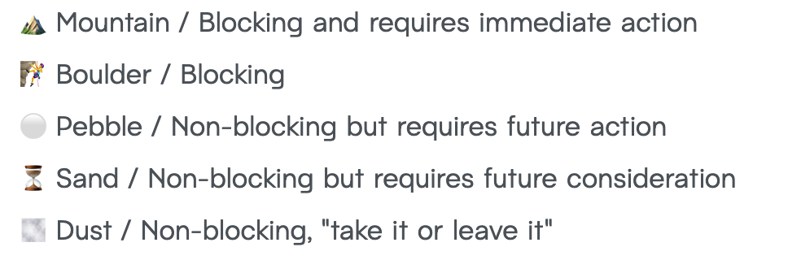

<!-- _class: title -->
<!-- _footer: "" -->


# Collaborating Effectively<br/>Through Pull Requests

### 👦 Steven Hicks

### 🌎 pull-requests.stevenhicks.me

### ✉️ stevenhicks.me/where/

---

<!-- _class: invert -->
<!-- _backgroundColor: black -->


<!--
I'm a Developer Experience Engineer at Camunda

Camunda builds a process orchestration platform

we have a booth, come visit!

I work mainly on the infrastructure for our documentation

And a big part of that is making sure the contributor experience for our docs is enjoyable

-->

---

```javascript
[
  'What even is a pull request (PR)?',

  ...'6 Principles for collaborating effectively.',
];
```

---

<!-- section 0: What even is a PR? -->

<!-- _class: invert -->

# What even is a pull request (PR)?

<!-- level-setting -->

---

<!-- _header: "**0: What even is a PR?** | 1 | 2 | 3 | 4 | 5 | 6 "  -->

## A pull request (PR) is a request to **incorporate code changes**.

<!--

aka merge request

-->

---

<!-- _header: "**0: What even is a PR?** | 1 | 2 | 3 | 4 | 5 | 6 "  -->

## A PR includes a **title** and **description**.


<!--

(read title and description)

summarize the changes you'd like incorporated

-->

---

<!-- _header: "**0: What even is a PR?** | 1 | 2 | 3 | 4 | 5 | 6 "  -->

## A PR includes **a commit history**.


---

<!-- _header: "**0: What even is a PR?** | 1 | 2 | 3 | 4 | 5 | 6 "  -->

## A PR includes **code changes**.


<!-- represented in a diff format -->

---

<!-- _header: "**0: What even is a PR?** | 1 | 2 | 3 | 4 | 5 | 6 "  -->

## A PR is a means to do a **code review**.

---

<!-- _header: "**0: What even is a PR?** _Code review._ | 2 | 3 | 4 | 5 | 6 "  -->


<!-- so we can talk about the code changes -->

---

<!-- _header: "**0: What even is a PR?** _Code review._ | 2 | 3 | 4 | 5 | 6 "  -->


<!-- and a reviewer can suggest changes -->

---

<!-- _header: "**0: What even is a PR?** _Code review._ | 2 | 3 | 4 | 5 | 6 "  -->


<!-- and in the end, hopefully, the changes are approved. -->

---

<!-- _header: "**0: What even is a PR?** _Code review._ | 2 | 3 | 4 | 5 | 6 "  -->


<!-- so that the owner can incorporate the changes -->

---

<!-- _header: "**0: What even is a PR?** | 1 | 2 | 3 | 4 | 5 | 6 "  -->

# A PR is **communication** and **collaboration**.

---

<!-- _header: "**0: What even is a PR?** _Communication and collaboration._ | 2 | 3 | 4 | 5 | 6 "  -->

## A PR is an opportunity to **share knowledge**.

<!-- prettier-ignore -->
1) Build shared understanding.
<!-- prettier-ignore -->
2) Mentor.
<!-- prettier-ignore -->
3) Protect against risk.

<!--
an opportunity to share knowledge

1. of our system

2. mentor each other

3. in case one of us wins the lottery

-->

---

<!-- _header: "**0: What even is a PR?** _Communication and collaboration._ | 2 | 3 | 4 | 5 | 6 "  -->

## A PR provides a historical record.

<!-- prettier-ignore -->
1) Explain decisions made.
<!-- prettier-ignore -->
2) For **others** and **future you**.

<!--

so we can recall when we introduced changes

and why

...

many times that historical record is even for the person who made the changes

because it's hard for anyone to remember what they were thinking a month ago

-->

---

<!-- _header: "**0: What even is a PR?** | 1 | 2 | 3 | 4 | 5 | 6 "  -->


# This is a <br/> **Pull Request (PR)** <br/> talk.

<!-- we'll talk about using pull requests specifically through GitHub  -->
<!-- most of what we're going to talk about is applicable to other source control platforms -->
<!-- there are a couple notes of GitHub specific tooling -->
<!-- you're in the right place if that's what you're looking for -->

---

<!-- _header: "**0: What even is a PR?** | 1 | 2 | 3 | 4 | 5 | 6 "  -->


# This is a <br/> ~~Pull Request (PR)~~ <br/> **culture** talk.

<!-- but more than GitHub, more than pull requests or merge requests, this is a talk about culture -->
<!-- and more specifically, asynchronous collaborative culture -->
<!--

also, shout out to olivia

-->

---

<!-- section 1: Act with compassion -->

<!-- _class: invert -->

# 1. Act with compassion.

---

<!-- _header: "0 | **1: Act with compassion.** | 2 | 3 | 4 | 5 | 6 "  -->


# Be **respectful**.

<!--

and kind?

I don't think I need to explain this any further

...but I'll show you an example that suggest I do.

-->

---

<!-- _header: "0 | **1: Act with compassion.** | 2 | 3 | 4 | 5 | 6 "  -->

> **Guest:** Oh sorry I realize what you mean now, I'm a bit of a slow learner and didn't think to check the docs 👶

> **Host 1:** Oh! No need to apologize! This is _our_ responsibility, not yours! Need to figure out how to make it easy/obvious for everyone. 😄

> **Host 2:** I'll believe you're a slow learner when you stop shipping docs sites with day-old tools 😅

---

<!-- _header: "0 | **1: Act with compassion.** | 2 | 3 | 4 | 5 | 6 "  -->

> **Guest:** \[technical question about a feature, including a code sample that didn't work as expected]

> **Host:** If you'd have put any effort into the documentation it's the first sentence here: \[link]

> **Host:** 😕

<!--

I mean maybe it's just me

but raise your hand if you'd prefer to be a part of the first community

raise your hand if you'd prefer to be part of the second community

...don't be a jerk.

-->

---

<!-- _header: "0 | **1: Act with compassion.** | 2 | 3 | 4 | 5 | 6 "  -->


# **Act** with compassion.

1. Act with positive intent.

<!-- prettier-ignore -->
2) Own your actions.

<!-- prettier-ignore -->
3) Call out bad acts.

<!--

And acting with compassion starts with what you can control

which is yourself

many people say "assume positive intent" but ironically that actually gives people an out to act _without_ positive intent

so let's focus on what we can do

2 - even with the right intent, impact can be negative. Own your actions when things go wrong.


3 - and on the other side, reward good acts

acts, not actors, because they don't know they're doing something bad

*we* can focus on building an environment

with enough psychological safety that people can feel more comfortable assuming positive intent


-->

---

<!-- _header: "0 | **1: Act with compassion.** | 2 | 3 | 4 | 5 | 6 "  -->


<!--

I said this is a talk about culture, and I want to share my favorite analogy

of culture as a community garden.

When you find a situation with good culture, it's like walking into a community garden that produces the best fruits and vegetables.

The carrots taste delicious, and you don't want to leave.

But the carrots don't grow themselves. The people in the community cultivate them.

When weeds start to take over, someone needs to pull them.

You can rely on someone else to do it, and still enjoy the carrots,

but you can also contribute.


Calling out bad acts in pull request interactions is a small but important contribution to the weeding of the carrots. It's critical to keeping the garden healthy.

-->

---

<!-- section 2: Acknowledge power dynamics -->

<!-- _class: invert -->

# 2. Acknowledge power dynamics.

<!--
Power dynamics have a huge impact on collaboration, especially in the interpretation of ambiguous communication.

If you think "this doesn't affect me,"
-->

---

<!-- _header: "0 | 1 | **2: Acknowledge power dynamics.** | 3 | 4 | 5 | 6 "  -->

## If you aren't **aware** of a power dynamic, you're probably on the **strong** side of it.

<!--
Power dynamics appear in every relationship we have.
You certainly know about them when you're on the weaker side of it.
And when you don't know about a power dynamic in a relationship, there's a good chance it's because you're on the stronger side.

They can be problematic, but we can also navigate them successfully in a team.

Especially if we are aware of them.

-->

---

<!-- _header: "0 | 1 | **2: Acknowledge power dynamics.** | 3 | 4 | 5 | 6 "  -->


## Power dynamics can be <br/>**multi-directional**.

<!--
and those multiple directions can conflict

For example,

I interact with my boss in my PRs every day.
She's my boss - that's one power dynamic, in which I am on the weaker side.

On the other hand, she looks to me for many technical details and decisions.

That's a power dynamic in the opposite direction, and it also appears in the interactions we have in a PR.
-->

---

<!-- _header: "0 | 1 | **2: Acknowledge power dynamics.** | 3 | 4 | 5 | 6 "  -->


1. Choose words with care & **intention**.

<!-- prettier-ignore -->
2) Be **explicit** instead of implicit.

<!--

The weight of our words, especially when we're on the strong side of the dynamic, is incredible.

Choose them carefully.

...

And to avoid misinterpretation of words in a power dynamic

be explicit instead of implicit.

When something isn't that important, SAY SO.

When it is important, SAY SO.

Don't leave it up to the reader to interpret.

Feedback from the strong side takes on a very heavy weight.
That weight can easily elevate something that doesn't matter to something that is perceived to matter very much.

-->

---

<!-- section 3: Choose curiosity over judgement -->

<!-- _class: invert -->

# 3. Choose curiosity over judgement.

---

<!-- _header: "0 | 1 | 2 | **3: Curiosity over judgement.** | 4 | 5 | 6 "  -->


# Don't make **assumptions**.

<!--

when a line of code doesn't make sense, it usually doesn't mean the author is dumb,

it means you don't understand how they approached the problem

when a change in a PR doesn't make sense, that's often also the case.

-->

---

<!-- _header: "0 | 1 | 2 | **3: Curiosity over judgement.** | 4 | 5 | 6 "  -->

# **Ask**, don't guess.

### Get help understanding the things you don't understand.

<!--

if something doesn't make sense or seems wrong, ask questions about it

don't be afraid to take it to a synchronous conversation

just make sure that any decisions that come out of that conversation, or discoveries, or anything interesting, makes its way back to the PR as a comment.

-->

---

<!-- section 3: remove ambiguity -->

<!-- _class: invert -->

# 4. Remove ambiguity.

---

<!-- _header: "0 | 1 | 2 | 3 | **4: Remove ambiguity.** | 5 | 6 "  -->

# **Ask** clarifying questions.

<!--
Back to our previous section about asking instead of guessing

If something is unclear, get more information.
-->

---

<!-- _header: "0 | 1 | 2 | 3 | **4: Remove ambiguity.** | 5 | 6 "  -->


# **Communicate** effectively.

<!-- prettier-ignore -->
1) Clearly
<!-- prettier-ignore -->
2) Completely
<!-- prettier-ignore -->
3) Concisely
<!-- prettier-ignore -->
4) Bidirectionally

<!--

this is probably a non-controversial statement
and also very nebulous
we're all trying to do this in a lot of ways
here are some things to focus on.

-->

---

<!-- _header: "0 | 1 | 2 | 3 | **4: Remove ambiguity.** | 5 | 6 "  -->

# Communicate effectively **asynchronously**.

<!-- prettier-ignore -->
1) Minimize round trips.

<!--
And we need to especially *focus* on asynchronous communication.
Collaborating through PRs is *inherently asynchronous*, and with that comes some *really great* things.
We can *collaborate across time and location*.
People can *respond when it's the right time* for them, because *right now might not be the best time.
So everyone can *take their time before responding*.

And that means we get their

- best focus
- best ideas
- best self

(pause)

But there is *slowness* to asynchronous communication. That can be really *frustrating*.

The most important thing you can do to *prevent that pain*,

...

is to minimize round trips.

And that means doing all the *things we've talked about*, and some things we will talk about soon.

Providing clarity, giving complete information, etc

and proactively, so that the reader doesn't need to ask as many clarifying questions.

-->

---

<!-- _header: "0 | 1 | 2 | 3 | **4: Remove ambiguity.** _Communicate effectively asynchronously_ | 5 | 6 "  -->


<!--

Because you can't have conversations like the ones I have with my 12yo

Where it takes ten round-trips to get to the point

Especially when you're working across time zones and you have to wait until tomorrow to see a response to each exchange.

(answer: the sleepover, cousin muffin has skipped a nap and is unhinged)

-->

---

<!-- _header: "0 | 1 | 2 | 3 | **4: Remove ambiguity.** | 5 | 6 "  -->

# State the unstated.

<!--

Assumptions, context, conclusions...all of these things can easily be misinterpreted. State them explicitly.

-->

---

<!-- _header: "0 | 1 | 2 | 3 | **4: Remove ambiguity.** | 5 | 6 "  -->

# Be **direct**.

<!--

Compassionately, obviously,

but say what you want to say. An example:

a few years ago I started doing this thing where I wanted to be extra friendly and considerate in my PR reviews

-->

---

<!-- _header: "0 | 1 | 2 | 3 | **4: Remove ambiguity.** _Be direct._ | 5 | 6 "  -->

<!-- prettier-ignore -->
> "**What do you think** about doing X instead of Y?" ❌

<!-- prettier-ignore -->
> "I think **we should do** X instead of Y, because Z." ✅

<!--

So no matter how important I thought a change was, I'd phrase comments like the top

Extremely passively and indirect

But what I really meant was the bottom - I think we should make this change.

The top can be fine if you really don't have an opinion,

just make sure you're saying what you mean.

-->

---

<!-- _header: "0 | 1 | 2 | 3 | **4: Remove ambiguity.** | 5 | 6 "  -->


# Give **direction**.

---

<!-- _header: "0 | 1 | 2 | 3 | **4: Remove ambiguity.** _Give direction._ | 5 | 6 "  -->

## Communicate **expectations**.


<!--
frustratingly, this kind of documentation exists solely to point people to
after they've proven that they didn't read it
but it's still important to have something to point to
-->

---

<!-- _header: "0 | 1 | 2 | 3 | **4: Remove ambiguity.** _Give direction._ | 5 | 6 "  -->

## Provide **clear** and **direct** templates.


<!--

define issue and PR templates in your repo

- Suggest a format to enforce consistency of PRs, which can reduce cognitive load
- we use comments to give guidance
- Use checklists to guide progress and establish requirements

-->

---

<!-- _header: "0 | 1 | 2 | 3 | **4: Remove ambiguity.** _Give direction._ | 5 | 6 "  -->

## Provide **clear** and **direct** templates. ❌

## 

<!--
I emphasize clear and direct because any squishy language will just be ignored.

Example: checklist in screenshot!

-->

---

<!-- _header: "0 | 1 | 2 | 3 | **4: Remove ambiguity.** _Give direction._ | 5 | 6 "  -->

## Explicitly **assign responsibilities**.

<!-- prettier-ignore -->
* Assignee; reviewers.
<!-- prettier-ignore -->
* Establish a **working agreement** to remove ambiguity.
  - Who merges?
  - What is a reviewer's responsibility?

<!--

1 - assign the PR to someone, and add reviewers...

2 - whether documented or enforced by convention or automation

-->

---

<!-- _header: "0 | 1 | 2 | 3 | **4: Remove ambiguity.** _Give direction._ | 5 | 6 "  -->

## Use the **suggestion** feature.


<!--
during reviews

Allows a person to commit the prescribed changes directly in the GitHub UI.

Especially nice for very small changes.

Becomes more difficult to manage when there are synchronized suggestions in multiple places,
like changing a variable name.

-->

---

<!-- _header: "0 | 1 | 2 | 3 | **4: Remove ambiguity.** _Give direction._ | 5 | 6 "  -->

## State **the importance** of addressing the feedback.

<!--

the perceived importance is usually just tied to where you are in the power dynamic

- this slide is the reason I started writing this talk - my first ever opinion on PRs & PR reviews

- Is this feedback blocking or non-blocking?
- are you expecting them to address this in this PR? another?
- these are all things I want to know about your feedback so that I can respond correctly

-->

---

<!-- _header: "0 | 1 | 2 | 3 | **4: Remove ambiguity.** _Give direction by stating the importance._ | 5 | 6 "  -->

### [Netlify's feedback ladder](https://www.netlify.com/blog/2020/03/05/feedback-ladders-how-we-encode-code-reviews-at-netlify/).



<!-- a couple examples of formalizing this -->

---

<!-- _header: "0 | 1 | 2 | 3 | **4: Remove ambiguity.** _Give direction by stating the importance._ | 5 | 6 "  -->

### [Conventional Comments](https://conventionalcomments.org/).


<!--

conventional comments introduces a consistent structure to your review comments

-->

---

<!-- _header: "0 | 1 | 2 | 3 | **4: Remove ambiguity.** | 5 | 6 "  -->


# Radiate **intent**

<!--

As giving direction relates to how we expect others to act,

just as important is radiating intent on how _we_ plan to act.


ambiguity and uncertainty are what lead to those round trips

which we know take a long time to resolve when working asynchronously.

when we radiate intent on what we plan to do,

we can snuff those out

...

some specific things we can do in our PRs to radiate intent...

-->

---

<!-- _header: "0 | 1 | 2 | 3 | **4: Remove ambiguity.**  _Radiate intent._ | 5 | 6 "  -->

## Draft/WIP.


<!--

let them know your work is in progress

(if you can remember that the Draft feature exists, which I never do)

gives them a chance to see what you're thinking about this line of work

-->

---

<!-- _header: "0 | 1 | 2 | 3 | **4: Remove ambiguity.**  _Radiate intent._ | 5 | 6 "  -->

## Do not merge/Prototype.


<!--

let them know this isn't to be merged ever

there's a tendency to think every PR must be merged

but opening a PR that proves out an idea is sometimes the best way to get good feedback

because everyone can see the code, and pull it down to run it

but when it's served its purpose, you can close it and re-implement with more production-worthy changes

-->

---

<!-- _header: "0 | 1 | 2 | 3 | **4: Remove ambiguity.**  _Radiate intent._ | 5 | 6 "  -->

## **What's included**, and what's not?


<!--

what is part of this PR, and what will you cover in a follow-up PR?

-->

---

<!-- _header: "0 | 1 | 2 | 3 | **4: Remove ambiguity.**  _Radiate intent._ | 5 | 6 "  -->

## **What's included**, and what's not?


<!--

on an epic level, what is included in this feature?

-->

---

<!-- _header: "0 | 1 | 2 | 3 | **4: Remove ambiguity.** | 5 | 6 "  -->


> _I'm here to request changes <br/> **for the right reasons**_.

<!--

one aspect of pull requests that I think fully captures the problem of ambiguity

and benefits tremendously from all the strategies we've talked about to remove ambiguity

is the question of which changes should I be requesting in a PR review

has anyone collaborated on a project where PR review feedback was imbalanced

like one person wanted everyone else's code to look like they wrote it

and others on the team were more like "ehhh I can understand it, it's good"?

That's ambiguity at work.

-->

---

<!-- _header: "0 | 1 | 2 | 3 | **4: Remove ambiguity.** | 5 | 6 "  -->


## Are these **The Right Reasons**?

<!-- prettier-ignore -->
1) The code could be more readable.
<!-- prettier-ignore -->
2) Code that was not added or edited <br/>in the PR is wrong.
<!-- prettier-ignore -->
3) The syntax doesn't match my preference.

<!--

1 - what's readable?

if you're a functional programmer and I have a Java background and we're both writing javascript,

we're going to have very different perspectives on which code is more readable

2 - how wrong is wrong?

is it a variable name that doesn't make sense anymore?

is it costing us money?

where do we stand on the question of whether that fix should live in this PR or in a separate one?

3 -

what kind of ownership does the project have?

Is it a single owner/DRI/dictator?

Is there no one owner but maintained by 5 different people?

-->

---

<!-- _header: "0 | 1 | 2 | 3 | **4: Remove ambiguity.** | 5 | 6 "  -->


# **Intentionally define** <br/>The Right Reasons.

<!--

All this to say

Ambiguity leads to imbalances,

and honestly inequities.

It leads to different collaborators being held to different standards.

Sometimes that's what you want

But often it's not

The best way to kill ambiguity is to define rules of engagement more precisely

With a working agreement or ways of working or something tangible that you can point to

-->

---

<!-- section 4: tell stories -->

<!-- _class: invert -->

# 5. Tell stories.

<!--

A good story has all of the qualities we've talked about so far

But we can also talk about some more specifics

-->

---

<!-- _header: "0 | 1 | 2 | 3 | 4 | **5: Tell stories.** | 6 "  -->


# Provide **context**.

<!--

So that you can avoid the round-trips of clarifying questions, which in an asynchronous environment can drag things on and on and on

One rule to live by ...

-->

---

<!-- _header: "0 | 1 | 2 | 3 | 4 | **5: Tell stories.** _Provide context._ | 6 "  -->


## Don't **assume** prior knowledge.

<!--

Even if the reader has perfect context when they read your message today

In a month, when someone's looking back at this work, trying to figure out when, why, and how a feature was introduced...

maybe that person is you...

that context and knowledge won't be there. It's really helpful to have it all written up for posterity.

-->

---

<!-- _header: "1 | 2 | 3 | **4: Good pull requests.** _Provide context._ | 5 | 6 "  -->

## Proactively **explain**.

<!-- prettier-ignore -->
1) Describe **motivation**/background/problem solved.
<!-- prettier-ignore -->
2) Explain **reasoning**.
<!-- prettier-ignore -->
3) Describe **alternatives** considered.

<!--

1 - what are we trying to do here?

2 - why does this new code exist?

during a review, why do you recommend this change?

what's going to happen in the system that they're not realizing?

3 - and why you chose this approach over the others

and again remember that you could very easily create a PR template that encourages including these things

-->

---

<!-- _header: "1 | 2 | 3 | **4: Good pull requests.** _Provide context._ | 5 | 6 "  -->

## **Show**, don't tell.

### Compare the **before** and **after** states.


<!--

when possible, give them something visual

so that they can see the effects without running the PR locally

I don't expect you to be able to read anything on here,
but I think you can see the difference in size of those orange squares

-->

---

<!-- _header: "0 | 1 | 2 | 3 | 4 | **5: Tell stories.** _Provide context._ | 6 "  -->

<!-- _footer: "" -->

## **Show**, don't tell.

### Walk them through the changes.


<!--

- you can give yourself a PR review!
- this is often the first thing I do when I open a PR

-->

---

<!-- _header: "0 | 1 | 2 | 3 | 4 | **5: Tell stories.** _Provide context._ | 6 "  -->

## **Show**, don't tell.

### Explain **non-obvious**<br/> lines of code.


<!--

and when a line is particularly tricky, that's a great time to explain

-->

---

<!-- _header: "0 | 1 | 2 | 3 | 4 | **5: Tell stories.** _Provide context._ | 6 "  -->

## **Show**, don't tell.

### Explain **non-obvious** lines of code **in the code**.

<!--

Though if you find yourself explaining a single line of code in a pull request review,

there's a good chance you should also add that comment in the code

doing a self-review when opening a PR is a good opportunity to catch things like this.

-->

---

<!-- _header: "0 | 1 | 2 | 3 | 4 | **5: Tell stories.** _Provide context._ | 6 "  -->

## **Show**, don't tell.

### Show **impact** not obvious in the code.

---

<!-- _header: "0 | 1 | 2 | 3 | 4 | **5: Tell stories.** _Provide context._ | 6 "  -->

## Include **sources**.

<!-- prettier-ignore -->
1) Point to **other examples**.
<!-- prettier-ignore -->
2) Point to **conversations**.

<!--

1
- in a PR, what's an example you followed?
- in a review requesting changes, what's an example they can follow?

2
- (conversations, tickets, etc)
- be aware of access & privacy

-->

---

<!-- _header: "0 | 1 | 2 | 3 | 4 | **5: Tell stories.** | 6 "  -->

# Be **concise** and **cohesive**.

<!--

a good story is concise -- it doesn't drown you with superfluous info

it's also cohesive -- the words that are there work together instead of against each other.

In a pull request, we can easily fall into the trap of including everything you did since your previous one

even if it's not directly related to the work we're doing

And to avoid this, we want to make sure we break our work up into right-sized pieces

Too big, or too sprawling, and they can be too difficult for a person to review,
and they'll rubberstamp LGTM,
and two weeks later we discover the bug we snuck into that big rubberstamped PR.

-->

---

<!-- _header: "0 | 1 | 2 | 3 | 4 | **5: Tell stories.** _Be concise and cohesive._ | 6 "  -->

## Break up changes that require <br/>a **different mindset** to review.

<!-- prettier-ignore -->
1) By architectural layer.
<!-- prettier-ignore -->
2) By infrastructural vs implementation.
<!-- prettier-ignore -->
3) By risky vs routine.

<!--

Sometimes it's obvious how to break up a PR that isn't concise or cohesive

But often it's not

my guiding light for separating the tricky ones is to break them up by mindset required to review them

when a PR contains different types of work that require different mindets to review, it's more likely to draw the LGTM response,
which translates to "there were too many things going on and I didn't totally get it all, but I inherently trust you."

1 - api vs front-end, etc
2 - infra invites more thorough review of concepts;
  - implementation is more "are you following the existing patterns."
  - includes the "walking skeleton" approach, where you start with a PR that just puts the infrastructure in place so that different parts _can_ function together...then implementing each of the functions into the skeleton.
3 - routine work that follows existing patterns usually gets "hey you missed this" type of feedback; novel work that takes thoughtful consideration of approaches invites more theoretical feedback.

Ideally you can do this with separate PRs.
If you can't, at the very least practice good commit hygiene to separate your work....which leads me....

-->

---

<!-- _header: "0 | 1 | 2 | 3 | 4 | **5: Tell stories.** _Be concise and cohesive._ | 6 "  -->


## Practice good commit **hygiene**.

<!--

One last potentially more controversial point on cohesive stories

Commit hygiene

-->

---

<!-- _header: "0 | 1 | 2 | 3 | 4 | **5: Tell stories.** _Be concise and cohesive with good hygiene._ | 6 "  -->


## Make commits **atomic**.

<!-- prettier-ignore -->
1) Small.
<!-- prettier-ignore -->
2) Clear and concise message.
<!-- prettier-ignore -->
3) Description to add context.

<!--
You can amend them along the way to meet these criteria

-->

---

<!-- _header: "0 | 1 | 2 | 3 | 4 | **5: Tell stories.** _Be concise and cohesive with good hygiene._ | 6 "  -->


<!--

and when you do this, the commits _can_ tell a story

and I agree that 95% of the time that doesn't matter, because we're just looking at the diff view of the PR anyway

But sometimes it is easier to review a PR one commit at a time - especially refactoring PRs

and It's nice to provide people that option

(read for the back of room)

-->

---

<!-- _header: "0 | 1 | 2 | 3 | 4 | **5: Tell stories.** _Be concise and cohesive with good hygiene._ | 6 "  -->


<!--

(read for the back of room)

and as much as I love Pavlos

and as hilarious as these commit messages are

they don't provide me that option

-->

---

<!-- _header: "0 | 1 | 2 | 3 | 4 | **5: Tell stories.** | 6 "  -->


# Show **progress**.

<!-- prettier-ignore -->
1) Draft/Work In Progress (WIP) PRs.
<!-- prettier-ignore -->
2) Prototypes.
<!-- prettier-ignore -->
3) Walking Skeletons.
<!-- prettier-ignore -->
4) Requests For Comments (RFCs).

<!--

waiting until the very end for feedback results in more re-work

than collecting feedback along the way.

1 - use the draft feature if you remember it exists 😅 just make sure it's clearly marked as experimental/incomplete.

  - we'll talk more about this in a bit

2 - build prototypes that reviewers can play with by checking out the PR's branch

3 - build the infrastructure for a feature, and let people review that before you fill in the guts.

4 - these are technically better served as issues, but opening them can help you create a more successful PR.

...

I give you this advice knowing full well that it is my own biggest struggle

-->

---

<!-- _header: "0 | 1 | 2 | 3 | 4 | **5: Tell stories.** _Show progress._ | 6 "  -->


# Perfect is <br/>the **enemy of done**.

<!--

I think the actual quote is "enemy of good" but it makes more sense to me as enemy of done.

Again, this is as much a reminder to myself as it is to you,

...

When it comes to PRs, perfection might be getting in the way of shipping things.

-->

---

<!-- section 6: Grow together -->

<!-- _class: invert -->

# 6. Grow together.

<!--

Seems kind of silly, given we're talking about collaboration

But I think sometimes people forget

just a couple small tips here

-->

---

<!-- _header: "0 | 1 | 2 | 3 | 4 | 5 | **6: Grow together.** "  -->

# Give **credit**.


<!--

give credit where credit is due

This is especially important when more experienced pair with less experienced

If you work together on something, add both contributors to the commits.

Give the less experience credit to help build their portfolio of work.

-->

---

<!-- _header: "0 | 1 | 2 | 3 | 4 | 5 | **6: Grow together.** "  -->

# Give **credit**.

## [github.com/jonallured/pear](https://github.com/jonallured/pear) 🍐🍐🍐

---

<!-- _header: "0 | 1 | 2 | 3 | 4 | 5 | **6: Grow together.** "  -->


# **Spread knowledge**.

<!-- prettier-ignore -->
1) Share your learnings.
<!-- prettier-ignore -->
2) Share development tips.

<!--

whether it's to build shared understanding,

or for mentoring purposes,

or for the lottery factor,

1 - maybe it's something you learned about the product

maybe it's something you learned about the programming language

2 - how did I do this thing that you might also need to do?

what cool dev tool features did I learn about while testing this?

-->

---

## 1. Act with **compassion**.

## 2. Acknowledge **power dynamics**.

## 3. Choose **curiosity** over judgement.

## 4. Remove **ambiguity**.

## 5. Tell **stories**.

## 6. Grow **together**.

---

<!-- _class: invert title -->

# **Thank you!**

##### 👦 Steven Hicks

##### 🌎 pull-requests.stevenhicks.me

##### ✉️ stevenhicks.me/where/

---

<!-- _class: invert -->

# Shame~~less~~ful self-promotion.

### [anchor.fm/a-developer-experience](https://anchor.fm/a-developer-experience)

### [youtube.com/@2RadDads](https://www.youtube.com/@2RadDads)


