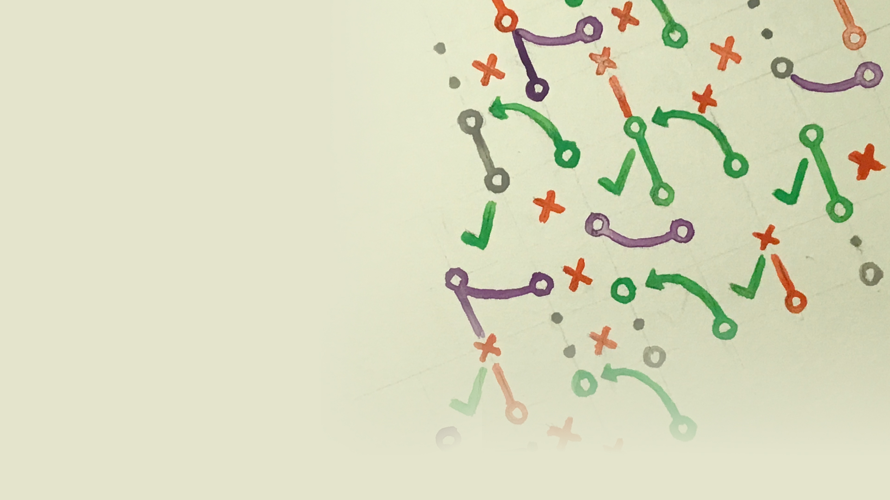
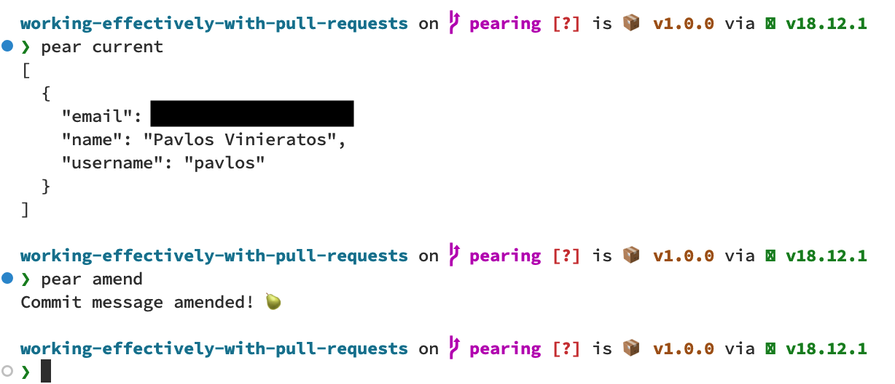

<!-- _class: title -->

# Working Effectively With Pull Requests

### 👦 Steven Hicks

### 🌎 pull-requests.stevenhicks.me

### ✉️ stevenhicks.me/where/

---

<!-- _footer: "" -->

---

<!-- _footer: "" -->

---

<!-- _class: invert -->
<!-- _backgroundColor: black -->

<!--
I'm a Developer Experience Engineer at Camunda

Camunda builds a process orchestration platform

I work mainly on the infrastructure for our documentation

Camunda has a booth, come visit!
 -->

---

<!-- _class: invert -->

# Shame~~less~~ful self-promotion.

### [anchor.fm/a-developer-experience](https://anchor.fm/a-developer-experience)

---

<!-- _class: invert -->

# Shame~~less~~ful self-promotion.

### [youtube.com/@2RadDads](https://www.youtube.com/@2RadDads)

---

## 1. What even is a pull request (PR)?

## 2. Ground rules.

## 3. The work before the work.

## 4. Good pull requests.

## 5. Good PR reviews.

## 6. Final thoughts.

---

<!-- section 1: What even is a PR? -->

<!-- _class: invert -->

# 1. What even is a pull request (PR)?

<!-- level-setting -->

---

<!-- _header: "**1: What even is a PR?** | 2 | 3 | 4 | 5 | 6 "  -->

## A pull request (PR) is a request to **incorporate code changes**.

<!--

aka merge request

-->

---

<!-- _header: "**1: What even is a PR?** | 2 | 3 | 4 | 5 | 6 "  -->

## A PR includes a **title** and **description**.

<!--

(read title and description)

summarize the changes you'd like incorporated

-->

---

<!-- _header: "**1: What even is a PR?** | 2 | 3 | 4 | 5 | 6 "  -->

## A PR includes **a commit history**.

---

<!-- _header: "**1: What even is a PR?** | 2 | 3 | 4 | 5 | 6 "  -->

## A PR includes **code changes**.

<!-- represented in a diff format -->

---

<!-- _header: "**1: What even is a PR?** | 2 | 3 | 4 | 5 | 6 "  -->

## A PR is a means to do a **code review**.

---

<!-- _header: "**1: What even is a PR?** _Code review._ | 2 | 3 | 4 | 5 | 6 "  -->

<!-- so we can talk about the code changes -->

---

<!-- _header: "**1: What even is a PR?** _Code review._ | 2 | 3 | 4 | 5 | 6 "  -->

<!-- and a reviewer can suggest changes -->

---

<!-- _header: "**1: What even is a PR?** _Code review._ | 2 | 3 | 4 | 5 | 6 "  -->

<!-- and in the end, hopefully, the changes are approved. -->

---

<!-- _header: "**1: What even is a PR?** _Code review._ | 2 | 3 | 4 | 5 | 6 "  -->

<!-- so that the owner can incorporate the changes -->

---

<!-- _header: "**1: What even is a PR?** | 2 | 3 | 4 | 5 | 6 "  -->

# A PR is **communication** and **collaboration**.

---

<!-- _header: "**1: What even is a PR?** _Communication and collaboration._ | 2 | 3 | 4 | 5 | 6 "  -->

## A PR is an opportunity to **share knowledge**.

<!-- prettier-ignore -->
1) Build shared understanding.
<!-- prettier-ignore -->
2) Mentor.
<!-- prettier-ignore -->
3) Protect against risk.

<!--
an opportunity to share knowledge

1. of our system

2. mentor each other

3. in case one of us wins the lottery

-->

---

<!-- _header: "**1: What even is a PR?** _Communication and collaboration._ | 2 | 3 | 4 | 5 | 6 "  -->

## A PR provides a historical record.

<!-- prettier-ignore -->
1) Explain decisions made.
<!-- prettier-ignore -->
2) For **others** and **future you**.

---

<!-- _header: "**1: What even is a PR?** | 2 | 3 | 4 | 5 | 6 "  -->

# This is a   **Pull Request (PR)**   talk.

<!-- we'll talk about using pull requests specifically through GitHub  -->
<!-- most of what we're going to talk about is applicable to other source control platforms -->
<!-- there are a couple notes of GitHub specific tooling -->
<!-- you're in the right place if that's what you're looking for -->

---

<!-- _header: "**1: What even is a PR?** | 2 | 3 | 4 | 5 | 6 "  -->

# This is a   ~~Pull Request (PR)~~   **culture** talk.

<!-- but more than GitHub, more than pull requests or merge requests, this is a talk about culture -->
<!-- and more specifically, asynchronous collaborative culture -->

---

<!-- section 2: Ground rules -->

<!-- _class: invert -->

# 2. Ground rules.

<!-- we're starting with cultural ground rules for collaborative work -->
<!-- and then we're going to talk about specific actions you can take to improve collaborative coding -->
<!-- but you're going to see all sorts of the culture in the actions -->

---

<!-- _header: "1 | **2: Ground rules.** | 3 | 4 | 5 | 6 "  -->

# Practice **curiosity**   over judgement.

<!-- prettier-ignore -->
1) Ask, don't guess.
<!-- prettier-ignore -->
2) Don't make assumptions.

<!-- if something doesn't make sense or seems wrong, ask questions about it -->

---

<!-- _header: "1 | **2: Ground rules.** | 3 | 4 | 5 | 6 "  -->

# ~~Assume positive intent.~~

<!-- ...
we want this slide to say "assume positive intent"
but in an environment that isn't psychologically safe,
"assume positive intent" puts the onus on the abused instead of the abuser.

We can't just magically wave our hands and say "this is now a safe space, you should assume everyone means well."

-->

---

<!-- _header: "1 | **2: Ground rules.** | 3 | 4 | 5 | 6 "  -->

# **Act** with compassion.

1. Act with positive intent.
<!-- prettier-ignore -->

2) Call out bad acts.

<!-- So let's start with what we can control
and focus on building an environment
with enough psychological safety that people can feel more comfortable assuming positive intent

And that starts with you.

...

and it also means enforcing psychological safety by calling out bad acts

bad acts, not actors, because they don't know they're doing something bad

-->

---

<!-- _header: "1 | **2: Ground rules.** _Act with compassion._ | 3 | 4 | 5 | 6 "  -->

<!--
I said this is a talk about culture, and I want to share my favorite analogy

of culture as a community garden.

When you find a situation with good culture, it's like walking into a community garden that produces the best fruits and vegetables.

The carrots taste delicious, and you don't want to leave.

But the carrots don't grow themselves. The people in the community cultivate them.

When weeds start to take over, someone needs to pull them.

You can rely on someone else to do it, and still enjoy the carrots,

but you can also contribute.

Calling out bad acts in pull request reviews is a small but important contribution to the weeding of the carrots. It's critical to keeping the garden healthy.

-->

---

<!-- _header: "1 | **2: Ground rules.** | 3 | 4 | 5 | 6 "  -->

# Be aware of  **power dynamics**.

<!--
Power dynamics have a huge impact on collaboration, especially in the interpretation of ambiguous communication.

If you think "this doesn't affect me,"
-->

---

<!-- _header: "1 | **2: Ground rules.** _Be aware of power dynamics._ | 3 | 4 | 5 | 6 "  -->

## If you aren't **aware** of a power dynamic, you're probably on the **strong** side of it.

<!--
Power dynamics appear in every relationship we have.
You certainly know about them when you're on the weaker side of it.
And when you don't know about a power dynamic in a relationship, there's a good chance it's because you're on the stronger side.
-->

---

<!-- _header: "1 | **2: Ground rules.** _Be aware of power dynamics._ | 3 | 4 | 5 | 6 "  -->

## Power dynamics can be **conflicting**.

<!--
For example,

I interact with my boss in my PRs every day.
She's my boss - that's one power dynamic, in which I am on the weaker side.

On the other hand, she looks to me for many technical details and decisions.

That's a power dynamic in the opposite direction, and it also appears in the interactions we have in a PR.
-->

---

<!-- _header: "1 | **2: Ground rules.** | 3 | 4 | 5 | 6 "  -->

# Be aware of **power dynamics**.

<!-- prettier-ignore -->
1) Choose words with care and intention.

<!-- prettier-ignore -->
2) Be explicit instead of implicit.

<!--
These exist in almost every relationship we have.

They can be problematic, but we can also navigate them successfully in a team.

We really just need to be aware of them.

...

And the weight of our words, especially when we're on the strong side of the dynamic.

...

I think the best way to avoid misinterpretation of words in a power dynamic

is to be explicit instead of implicit.

When something isn't that important, SAY SO.

When it is important, SAY SO.

Don't leave it up to the reader to interpret.

Feedback from the strong side takes on a very heavy weight. That weight can easily elevate something from "doesn't matter" to "matters very much," even if it doesn't.

-->

---

<!-- _header: "1 | **2: Ground rules.** | 3 | 4 | 5 | 6 "  -->

# **Communicate** effectively.

<!-- prettier-ignore -->
1) Use clear, concise, and  unambiguous language.

<!-- prettier-ignore -->
2) Ask clarifying questions.

<!-- prettier-ignore -->
3) Radiate intent.

<!-- prettier-ignore -->
4) State the unstated.

<!-- prettier-ignore -->
5) Be direct (compassionately).

<!--
this is probably a non-controversial statement
we're all trying to do this in a lot of ways
here are some communication tips that are critical to a good PR interaction.

...

often it's easier to notice others using unclear ambiguous language, so help them out by letting them know you don't understand

...

If something is unclear, get more information.

...

Make it clear what you will do and what you won't;
what you're expecting and what you're not expecting.

...

Assumptions, context, conclusions...all of these things can easily be misinterpreted. State them explicitly.

...

-->

---

<!-- _header: "1 | **2: Ground rules.** | 3 | 4 | 5 | 6 "  -->

# Communicate effectively **asynchronously**.

<!-- prettier-ignore -->
1) Minimize round trips.

<!--
And we need to especially *focus* on asynchronous communication.
Collaborating through PRs is *inherently asynchronous*, and with that comes some *really great* things.
We can *collaborate across time and location*.
People can *respond when it's the right time* for them, because *right now might not be the best time.
So everyone can *take their time before responding*.

And that means we get their

- best focus
- best ideas
- best self

(pause)

But there is *slowness* to asynchronous communication. That can be really *frustrating*.

The most important thing you can do to *prevent that pain*,

...

is to minimize round trips.

And that means doing all the *things we've talked about*.

Providing context, clarity, radiating intent, removing ambiguity

giving the reader enough to go on so that they don't need to ask questions.

-->

---

<!-- _header: "1 | **2: Ground rules.** _Communicate effectively asynchronously._ | 3 | 4 | 5 | 6 "  -->

<!--

Because this is the worst.

Especially when you're working across time zones and you have to wait until tomorrow to see a response.

-->

---

<!-- section 3: The work before the work -->

<!-- _class: invert -->

# 3. The work before the work.

<!--
ground rules in place,
let's look at the things that happen before opening a PR
which lend themselves to a frictionless PR experience.
-->

---

<!-- _header: "1 | 2 | **3: The work before the work.** | 4 | 5 | 6 "  -->

# Configure the project for **collaboration**.

---

<!-- _header: "1 | 2 | **3: The work before the work.** _Configure for collaboration._ | 4 | 5 | 6 "  -->

## Communicate **expectations**.

<!--
frustratingly, this kind of documentation exists solely to point people to
after they've proven that they didn't read it
so there are a couple things we can do to enforce norms
-->

---

<!-- _header: "1 | 2 | **3: The work before the work.** _Configure for collaboration._ | 4 | 5 | 6 "  -->

## Provide **clear** and **direct** templates.

<!--

- templates Suggest a format to enforce consistency of PRs, which can reduce cognitive load
- we use comments to give guidance
- Use checklists to guide progress and establish requirements
- Provide options to keep people within the rails ?

-->

---

<!-- _header: "1 | 2 | **3: The work before the work.** _Configure for collaboration._ | 4 | 5 | 6 "  -->

## Provide **clear** and **direct** templates.

## 

<!--
I emphasize clear and direct because any squishy language will just be ignored.

Example: checklist in screenshot!

-->

---

<!-- _header: "1 | 2 | **3: The work before the work.** _Configure for collaboration._ | 4 | 5 | 6 "  -->

## **Automate** the automatable.

<!--
- Syntax and formatting validation
- Assignment of roles

any rule that isn't enforced through automation will be violated

and then it's up to a person to find it/fix it

Ex: Amarabot to identify missing duplication in versions

-->

---

<!-- _header: "1 | 2 | **3: The work before the work.** | 4 | 5 | 6 "  -->

# Practice good commit **hygiene**.

<!--
on the code side of things
-->

---

<!-- _header: "1 | 2 | **3: The work before the work.** _Practice good commit hygiene._ | 4 | 5 | 6 "  -->

## Good commits are **atomic**.

<!-- prettier-ignore -->
1) Small.
<!-- prettier-ignore -->
2) Clear and concise message.
<!-- prettier-ignore -->
3) Description to add context.

<!--
You can amend them along the way to meet these criteria

-->

---

<!-- _header: "1 | 2 | **3: The work before the work.** _Practice good commit hygiene._ | 4 | 5 | 6 "  -->

## Good commits **tell a story**.

---

<!-- _header: "1 | 2 | **3: The work before the work.** _Practice good commit hygiene by telling a story._ | 4 | 5 | 6 "  -->

<!--

Sometimes it's easier to review a PR one commit at a time

It's nice to provide people that option

(read for the back of room)

-->

---

<!-- _header: "1 | 2 | **3: The work before the work.** _Practice good commit hygiene by telling a story._ | 4 | 5 | 6 "  -->

<!--

(read for the back of room)

and as much as I love Pavlos

and as hilarious as these commit messages are

they don't provide me that option

and they don't add any context

-->

---

<!-- _header: "1 | 2 | **3: The work before the work.** _Practice good commit hygiene._ | 4 | 5 | 6 "  -->

## Good commits include **all contributors**.

<!--

This is especially important when more experienced pair with less experienced

Give the less experience credit to help build their GitHub portfolio.

-->

---

<!-- _header: "1 | 2 | **3: The work before the work.** _Practice good commit hygiene._ | 4 | 5 | 6 "  -->

## Good commits include **all contributors**.

1. [github.com/jonallured/pear](https://github.com/jonallured/pear)

2. [github.com/git-duet/git-duet](https://github.com/git-duet/git-duet)

---

<!-- _header: "1 | 2 | **3: The work before the work.** _Practice good commit hygiene by including all contributors._ | 4 | 5 | 6 "  -->

<!--

A couple options for tools to make it easier to give credit when pairing

I recommend pear because my former coworker wrote it and it's a nice lightweight experience

-->

---

<!-- section 4: Good pull requests. -->

<!-- _class: invert -->

# 4. Good pull requests.

<!-- we finally made it! -->

---

<!-- _header: "1 | 2 | 3 | **4: Good pull requests.** | 5 | 6 "  -->

# Good PRs are **concise** and **cohesive**.

<!--
the tendency is to include everything you did since your last PR in this one you've just opened

often that violates concise or cohesive

-->

---

<!-- _header: "1 | 2 | 3 | **4: Good pull requests.** _Are concise and cohesive._ | 5 | 6 "  -->

## Break up changes that require a **different mindset** to review.

<!-- prettier-ignore -->
1) By architectural layer.
<!-- prettier-ignore -->
2) By infrastructural vs implementation.
<!-- prettier-ignore -->
3) By risky vs routine.

<!--
this is my guidance for separating pull requests

when a PR contains different types of work that require different mindets to review, it's more likely to draw the LGTM response, which usually means "there were too many things going on and I didn't totally get it all, but I inherently trust you."

1 - api vs front-end, etc
2 - infra invites more thorough review of concepts; implementation is more "are you following the existing patterns."
  - includes the "walking skeleton" approach, where you start with a PR that just puts the infrastructure in place so that different parts _can_ function together...then implementing each of the functions into the skeleton.
3 - routine work that follows existing patterns usually gets "hey you missed this" type of feedback; novel work that takes thoughtful consideration of approaches invites more theoretical feedback.

Ideally you can do this with separate PRs.
If you can't, at the very least practice good commit hygiene so that reviewers may easily review the risky changes separate from the routine changes, for example.

-->

---

<!-- _header: "1 | 2 | 3 | **4: Good pull requests.** | 5 | 6 "  -->

# Good PRs **show progress**.

<!-- prettier-ignore -->
1) Draft/Work In Progress (WIP) PRs.
<!-- prettier-ignore -->
2) Prototypes.
<!-- prettier-ignore -->
3) Walking Skeletons.
<!-- prettier-ignore -->
4) Requests For Comments (RFCs).

<!--

waiting until the very end for feedback results in more re-work

than collecting feedback along the way.

1 - use the draft feature if you remember it exists 😅 just make sure it's clearly marked as experimental/incomplete.

  - we'll talk more about this in a bit

2 - build prototypes that reviewers can play with by checking out the PR's branch

3 - build the infrastructure for a feature, and let people review that before you fill in the guts.

4 - these are technically better served as issues, but opening them can help you create a more successful PR.

...

I give you this advice knowing full well that it is my own biggest struggle

-->

---

<!-- _header: "1 | 2 | 3 | **4: Good pull requests.** _Show progress._ | 5 | 6 "  -->

## Perfect is the **enemy of done**.

<!--

I think the actual quote is "enemy of good" but it makes more sense to me as enemy of done.

Again, this is as much a reminder to myself as it is to you,

...

When it comes to PRs, perfection might be getting in the way of shipping things.

-->

---

<!-- _header: "1 | 2 | 3 | **4: Good pull requests.** | 5 | 6 "  -->

# Good PRs **provide context**.

<!--

So that you can avoid the round-trips of clarifying questions, which in an asynchronous environment can drag things on and on and on

One rule to live by ...

-->

---

<!-- _header: "1 | 2 | 3 | **4: Good pull requests.** _Provide context._ | 5 | 6 "  -->

## Don't **assume** prior knowledge.

<!--

Even if your reviewers have perfect context when they review the PR you opened today

In a month, when someone's looking back at this work, trying to figure out when, why, and how a feature was introduced...

maybe that person is you...

that context and knowledge won't be there. It's really helpful to have it all written up for posterity.

 -->

---

<!-- _header: "1 | 2 | 3 | **4: Good pull requests.** _Provide context._ | 5 | 6 "  -->

## Proactively **explain**.

<!-- prettier-ignore -->
1) Describe **motivation**/background/problem solved.
<!-- prettier-ignore -->
2) Explain **reasoning**.
<!-- prettier-ignore -->
3) Describe **alternatives** considered.

<!--

1 -

2 - why does this new code exist?

3 - and why you chose this approach over the others

-->

---

<!-- _header: "1 | 2 | 3 | **4: Good pull requests.** _Provide context._ | 5 | 6 "  -->

## **Show**, don't tell.

### Compare the **before** and **after** states.

<!--

I don't expect you to be able to read anything on here,
but I think you can see the difference in size of those orange squares

It's helpful to capture that kind of visual difference for a reviewer
So they can see the effects without running the PR locally

-->

---

<!-- _header: "1 | 2 | 3 | **4: Good pull requests.** _Provide context._ | 5 | 6 "  -->
<!-- _footer: "" -->

## **Show**, don't tell.

### Walk them through the changes.

<!--

- you can give yourself a PR review!
- this is often the first thing I do when I open a PR

-->

---

<!-- _header: "1 | 2 | 3 | **4: Good pull requests.** _Provide context._ | 5 | 6 "  -->

## **Show**, don't tell.

### Explain **non-obvious**  lines of code.

<!--

and when a line is particularly tricky, that's a great time to explain

-->

---

<!-- _header: "1 | 2 | 3 | **4: Good pull requests.** _Provide context._ | 5 | 6 "  -->

## **Show**, don't tell.

### Explain **non-obvious** lines of code **in the code**.

<!--

Though if you find yourself explaining a single line of code in a pull request review,

there's a good chance you should also add that comment in the code

doing a self-review when opening a PR is a good opportunity to catch things like this.

-->

---

<!-- _header: "1 | 2 | 3 | **4: Good pull requests.** _Provide context._ | 5 | 6 "  -->

## **Show**, don't tell.

### Show **impact** not obvious in the code.

---

<!-- _header: "1 | 2 | 3 | **4: Good pull requests.** | 5 | 6 "  -->

# Good PRs  **spread knowledge**.

<!--

whether it's to build shared understanding,

or for mentoring purposes,

or for the lottery factor,

-->

---

<!-- _header: "1 | 2 | 3 | **4: Good pull requests.** _Spread knowledge._ | 5 | 6 "  -->

## Share your **learnings**.

<!--

maybe it's something you learned about the product

maybe it's something you learned about the programming language

maybe it's something everyone else on your team already knows about....

but maybe it's not. In which case it's worth sharing.

-->

---

<!-- _header: "1 | 2 | 3 | **4: Good pull requests.** _Spread knowledge._ | 5 | 6 "  -->

## Share **development tips**.

<!--

how did I do this thing that you might also need to do?

what cool dev tool features did I learn about while testing this?

-->

---

<!-- _header: "1 | 2 | 3 | **4: Good pull requests.** | 5 | 6 "  -->

# Good PRs **radiate intent**.

<!--

use your turn signal

to remove ambiguity and uncertainty

because it's ambiguity and uncertainty that leads to those round trips

which we know take a long time to resolve when working asynchronously.

-->

---

<!-- _header: "1 | 2 | 3 | **4: Good pull requests.** _Radiate intent._ | 5 | 6 "  -->

## Draft/WIP.

<!--

let them know your work is in progress

(if you can remember that the Draft feature exists, which I never do)

gives them a chance to see what you're thinking about this line of work

-->

---

<!-- _header: "1 | 2 | 3 | **4: Good pull requests.** _Radiate intent._ | 5 | 6 "  -->

## Do not merge/Prototype.

<!--

let them know this isn't to be merged ever

there's a tendency to think every PR must be merged

but opening a PR that proves out an idea is sometimes the best way to get good feedback

because everyone can see the code, and pull it down to run it

but when it's served its purpose, you can close it and re-implement with more production-worthy changes

-->

---

<!-- _header: "1 | 2 | 3 | **4: Good pull requests.** _Radiate intent._ | 5 | 6 "  -->

## **What's included**, and what's not?

<!--

what is part of this PR, and what will you cover in a follow-up PR?

-->

---

<!-- _header: "1 | 2 | 3 | **4: Good pull requests.** _Radiate intent._ | 5 | 6 "  -->

## **What's included**, and what's not?

<!--

on an epic level, what is included in this feature?

-->

---

<!-- _header: "1 | 2 | 3 | **4: Good pull requests.** _Radiate intent._ | 5 | 6 "  -->

## Assign **roles**.

<!-- prettier-ignore -->
* Assignee; reviewers.
<!-- prettier-ignore -->
* Establish a **working agreement** to remove ambiguity.
  - Who merges?
  - What is a reviewer's responsibility?

<!--

1 - assign the PR to someone, and add reviewers...

2 - whether documented or enforced by convention or automation

-->

---

<!-- section 5: Good PR reviews. -->

<!-- _class: invert -->

# 5. Good PR reviews.

---

<!-- _header: "1 | 2 | 3 | 4 | **5: Good PR reviews.** | 6 "  -->

# Good reviews  **communicate effectively**.

---

<!-- _header: "1 | 2 | 3 | 4 | **5: Good PR reviews.** _Communicate effectively._ | 6 "  -->

## Be **respectful**.

<!--

I don't think I need to explain this any further

-->

---

<!-- _header: "1 | 2 | 3 | 4 | **5: Good PR reviews.** _Communicate effectively._ | 6 "  -->

## Be direct.

> "**What do you think** about doing X instead of Y?"

> "I think **we should do** X instead of Y, because Z."

<!--

a few years ago I started doing this thing where I wanted to be extra friendly and considerate

And I'd put comments phrased like the top

But what I really meant was the bottom

The top was too indirect and passive

The top can be fine if you really don't have an opinion,

just make sure you're saying what you mean.

-->

---

<!-- _header: "1 | 2 | 3 | 4 | **5: Good PR reviews.** _Communicate effectively._ | 6 "  -->

## Ask questions.

<!-- prettier-ignore -->
1) Don't make assumptions.
<!-- prettier-ignore -->
2) Get help understanding the things you don't understand.
<!-- prettier-ignore -->
3) Take it synchronous if it's still unclear.

<!--

remember, curiosity over judgement

1 - when something doesn't make sense, it usually doesn't mean the author is dumb, it means you don't understand how they approached the problem

2 - and then ask them to explain it so you can understand it

3 - if things go back and forth more than a couple times in comments, don't be afraid to take it to a synchronous conversation

just make sure that any decisions that come out of that conversation, or discoveries, or anything interesting, makes its way back to the PR as a comment.

-->

---

<!-- _header: "1 | 2 | 3 | 4 | **5: Good PR reviews.** | 6 "  -->

# Good reviews request changes   **for the right reasons**.

<!--

and I've got some bad news for you ...

-->

---

<!-- _header: "1 | 2 | 3 | 4 | **5: Good PR reviews.** _Request changes for the right reasons._ | 6 "  -->

## **You** define **The Right Reasons**.

<!--

I'm not going to tell you what the right reasons are

I recommend you establish a team agreement on what is fair game for requesting changes

-->

---

<!-- _header: "1 | 2 | 3 | 4 | **5: Good PR reviews.** _Request changes for the right reasons._ | 6 "  -->

## Are these **The Right Reasons**?

<!-- prettier-ignore -->
1) The code could be more readable.
<!-- prettier-ignore -->
2) Code that was not added or edited in the PR is wrong.
<!-- prettier-ignore -->
3) The syntax doesn't match my preference.

<!--

1 - careful! it's subjective

if I've got a function that needs to do four unrelated things in sequence, and each thing takes 2 lines of code,
would you rather see everything happen in one function, or one function that calls 4 2-line functions?

functional programmer's code vs javascript developers?

my personal rule is that I don't request changes for readability
unless I can use specific language about why it is not readable enough

2 - how wrong does it have to be to warrant sneaking into this PR vs creating another?

3 - my rule: if you can't give a subjective reason the code is improved, it's taste, and no one wins.

But, if you're a dictator & subjects power dynamic, the dictator wins

...

all this to say, establish a working agreement!

-->

---

<!-- _header: "1 | 2 | 3 | 4 | **5: Good PR reviews.** _Request changes for the right reasons._ | 6 "  -->

## Other guidance for requesting changes

<!-- prettier-ignore -->
1) Be explicit about **power dynamics**.
<!-- prettier-ignore -->
2) Practice **curiosity over judgement**.
<!-- prettier-ignore -->
3) Let the **robots** help.

<!--

1 - dictator & subjects? (aka DRI)

2 - Why did they do it differently than I would have?

- Does it even matter?

- Will I be able to understand this code when I stumble across it in 3 months?

3 - automate as much as possible

- prettier, linting, etc

- if any frequent manual checks can be automated, do it! that should be a robot's job.

-->

---

<!-- _header: "1 | 2 | 3 | 4 | **5: Good PR reviews.** | 6 "  -->

# Good reviews **provide context**.

<!-- prettier-ignore -->
1) Tell them **why** the code should change.
<!-- prettier-ignore -->
2) Point to **other code**.
<!-- prettier-ignore -->
3) Point to **conversations** outside of GitHub.

<!--

1
If there's a reason something needs to change, give them information about why
- why can't a variable be named X here?
- what is the negative impact that they're not seeing?
- share your understanding of the system
- don't just say "this won't work", tell them what the effect in the system will be
- there is a balance - be careful about excessive teaching because it can be condescending, and establish an unwanted power dynamic.

2
- what's an example they can follow?

3
- (conversations, tickets, etc)

-->

---

<!-- _header: "1 | 2 | 3 | 4 | **5: Good PR reviews.** | 6 "  -->

# Good reviews  **give direction**.

---

<!-- _header: "1 | 2 | 3 | 4 | **5: Good PR reviews.** _Give direction._ | 6 "  -->

## 1. Use the **suggestion** feature.

<!--

Allows a person to commit the prescribed changes directly in the GitHub UI.

Especially nice for very small changes.

Becomes more difficult to manage when there are synchronized suggestions in multiple places,
like changing a variable name.

-->

---

<!-- _header: "1 | 2 | 3 | 4 | **5: Good PR reviews.** _Give direction._ | 6 "  -->

## 2. Explicitly **assign responsibilities**.

<!--

- assign to someone to take action, if it isn't obvious.
- e.g. "assigning to you to merge when you feel the test coverage is adequate"

-->

---

<!-- _header: "1 | 2 | 3 | 4 | **5: Good PR reviews.** _Give direction._ | 6 "  -->

## 3. State **the importance** of addressing the feedback.

<!--

clearly!

- Is this feedback blocking or non-blocking?
- are you expecting them to address this in this PR? another?
- how much does it matter to you that they address it?
  - if you're picking nits, and you don't really care much if they're fixed, they might not know that
  - especially depending on the power dynamic.
  - I sometimes use the 1 to 10 on the "give a shit" meter to describe how much I care.

-->

---

<!-- _header: "1 | 2 | 3 | 4 | **5: Good PR reviews.** _Give direction by stating the importance._ | 6 "  -->

### [Netlify's feedback ladder](https://www.netlify.com/blog/2020/03/05/feedback-ladders-how-we-encode-code-reviews-at-netlify/).

---

<!-- _header: "1 | 2 | 3 | 4 | **5: Good PR reviews.** _Give direction by stating the importance._ | 6 "  -->

### [Conventional Comments](https://conventionalcomments.org/).

---

<!-- section 6: Getting it merged. -->

<!-- _class: invert -->

# 6. Final thoughts.

---

<!-- _header: "1 | 2 | 3 | 4 | 5 | **6: Getting it merged.** "  -->

## The **author** has responsibilities  to **support maintainers**.

<!--

So they don't burn out

If the maintainer asks you to rebase on `main`, you should do that.

You may ask for help if you don't know how to do the thing they're asking you to do...

But it is important to abide by the norms of the project, which unfortunately vary from one project to another.

-->

---

<!-- _header: "1 | 2 | 3 | 4 | 5 | **6: Final thoughts.** "  -->

## The **maintainers** have responsibilities  to **support contributors**.

<!--

at the same time....

...to remove friction

and enable people to contribute as easily as possible

because gatekeeping contributions to a project, whether intentional or unintentional, is a good way to prevent contributions.

-->

---

<!-- _header: "1 | 2 | 3 | 4 | 5 | **6: Final thoughts.** "  -->

## The best way to **maintain this balance** is to  **establish norms** and **communicate** them clearly.

<!--

through some sort of agreement

-->

---

<!-- _class: invert title -->

# **Thank you!**

##### 👦 Steven Hicks

##### 🌎 pull-requests.stevenhicks.me

##### ✉️ stevenhicks.me/where/

---

<!-- _footer: "" -->

